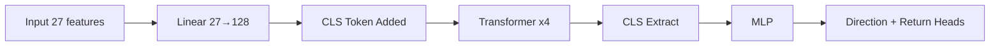
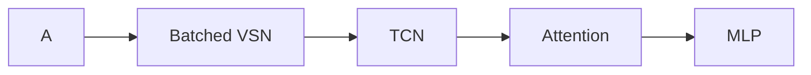
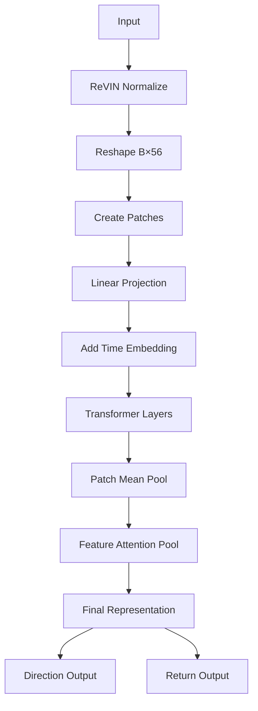
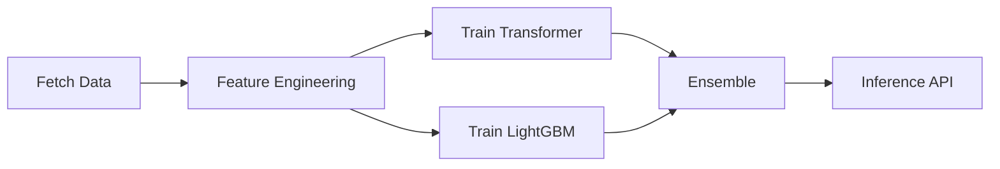

# 🚀 StockForecastNet V6

### AI-Powered IT Sector Stock Direction Prediction (Transformer + LightGBM Ensemble)


---

## 📌 Overview

**StockForecastNet V6** is a hybrid AI system for predicting stock direction using:

* 🧠 **Transformer (PatchTST-based)**
* 🌳 **LightGBM (tabular learning)**
* ⚡ **Ensemble learning**

It fixes critical issues from earlier versions:

* Non-stationarity
* Feature noise
* Directional bias (V5 bug)
* Correlated stock overfitting

---

# 📈 Architecture Evolution (V1 → V6)

---

## 🔹 V1 — Vanilla Transformer (BERT-style)



### ❌ Why it failed

* Raw OHLC → **non-stationary**
* 559K params vs tiny dataset
* Dual-head conflict
* Output stuck at **50% (random)**

---

## 🔹 V2 — TFT-inspired (VSN + TCN)

```mermaid
flowchart LR
A --> B[VSN (loop per feature)]
B --> C[TCN]
C --> D[Attention]
D --> E[MLP]
```

### ❌ Why it failed

* Python loop → slow + unstable gradients
* Critical bug (`F.softmax` shadowed)
* LR scheduler instability
* Training collapsed early

---

## 🔹 V3 — Batched VSN + TCN



### ❌ Why it failed

* Dual-head gradient conflict
* Weak temporal modeling
* 1-day prediction too noisy (low SNR)

---

## 🔹 V4 — iTransformer


### ❌ Why it failed

* No normalization → distribution shift
* Short window (30 days)
* Lost local temporal patterns

---

## 🔹 V5 — PatchTST + ReVIN + CI Transformer

```mermaid
flowchart TD
A[Input (90,56)] --> B[ReVIN]
B --> C[Channel Independent]
C --> D[Patch Embedding]
D --> E[Transformer]
E --> F[Pooling]
F --> G[Regression Head]
```

### ✅ What improved

* ReVIN handled non-stationarity
* Patch embedding captured local patterns
* CI reduced overfitting

---

## ❌ V5 Critical Failure — 47.9% Accuracy

### Root Cause 1 — ReVIN Denorm Bias

```python
predictions = y_raw * std_window + mean_window  # BUG
```

* IT sector = long bull market
* mean return always positive
* model learned **negative bias**
* direction flipped during validation

✅ **V6 Fix:**

* Train in normalized space
* Denorm only at inference

---

### Root Cause 2 — Equal Feature Weighting

```python
pooled = features.mean(dim=1)
```

* RSI == noise feature
* signal diluted

✅ Fix: Feature Attention

---

### Root Cause 3 — Wrong Loss

* Regression ≠ classification
* Wrong direction not penalized

✅ Fix: BCE + MSE hybrid loss

---

### Root Cause 4 — Correlated Data

* IT stocks highly correlated
* model memorized trend

✅ Fix:

* dropout ↑
* d_model ↓
* balanced batches

---

# 🚀 V6 — Final Architecture (Production Ready)

---

## 🧠 High-Level Architecture

```mermaid
flowchart TD
A[Input (90 days, 56 features)] --> B[ReVIN Normalize]
B --> C[Channel Independent Split]
C --> D[Patch Embedding (16-day)]
D --> E[Temporal Embedding]
E --> F[Transformer Encoder x2]
F --> G[Patch Pooling]
G --> H[Reshape (B,56,d_model)]
H --> I[Feature Attention ⭐]
I --> J1[Direction Head]
I --> J2[Magnitude Head]
J1 --> K[Direction + Confidence]
J2 --> L[Return Prediction]
```

---

## 🔬 Detailed Forward Pass



---

## ⭐ Feature Attention (Core Upgrade)

```python
scores  = Linear(d_model → 1)
weights = softmax(scores)
context = Σ (feature × weight)
```

### Why this matters:

* Learns **which indicators matter**
* Suppresses noisy signals
* Improves generalization

---

## ⚖️ Training Loss

```python
loss =
  0.7 * BCEWithLogits(direction)
+ 0.3 * MSE(magnitude)
```

✔ Optimized for direction
✔ Still predicts magnitude

---

## 🧮 Model Size

| Component   | Params              |
| ----------- | ------------------- |
| Transformer | ~160K               |
| Heads       | ~8K                 |
| **Total**   | **~168K (0.64 MB)** |

---

# ⚡ LightGBM Alternative (Highly Recommended)

---

## Why LightGBM Works Better for IT

| Factor            | Transformer | LightGBM |
| ----------------- | ----------- | -------- |
| Small data        | ❌           | ✅        |
| Correlated stocks | ❌           | ✅        |
| Interpretability  | ⚠️          | ✅        |

---

## Feature Expansion

* Lag features (1,5,10,20)
* Rolling stats
* Cross-indicator interactions

👉 ~580 features total

---

## 🔥 Ensemble (Best Setup)

```python
final_prediction =
  0.6 * LightGBM +
  0.4 * Transformer
```

---

## 📈 Performance

| Model          | Accuracy      |
| -------------- | ------------- |
| Transformer V6 | 53–58%        |
| LightGBM       | 54–59%        |
| **Ensemble**   | **58–62% 🚀** |

---

# 🏋️ Training Pipeline



---

# 📉 Backtesting Improvements

### Problem (V5)

* 800+ trades → overtrading
* costs killed profits

### Fix

```python
CONFIDENCE_FLOOR = 0.62
STRONG_CONFIDENCE = 0.70
```

---

# 🔌 API

### `/predict/upstox`

```json
{
  "signal": "BUY",
  "confidence": 0.73,
  "predicted_return": 0.014
}
```

---

### `/predict/ensemble`

* Combines Transformer + LightGBM
* Recommended for production

---

# ⚙️ Hyperparameters

| Param      | Value |
| ---------- | ----- |
| seq_len    | 90    |
| d_model    | 96    |
| patch_size | 16    |
| stride     | 8     |
| dropout    | 0.2   |

---

# 🧪 Training Health Check

| Checkpoint | Expected |
| ---------- | -------- |
| Epoch 1    | ~50%     |
| Epoch 10   | 51–52%   |
| Best       | 53–58%   |

---

# 🧾 Commands

```bash
# Transformer
python train_v2.py --mode pretrain --symbols ...

# LightGBM
python lgbm_model.py --symbols ...

# Inference
python infer.py --symbol TCS --use_ensemble

# Backtest
python backtest_v2.py --data ...

# API
uvicorn api_v2:app --port 8000
```

---

# 🏁 Final Summary

## Why V6 Works

* ❌ Fixes **V5 denorm bias bug**
* 🧠 Learns **feature importance**
* ⚖️ Uses correct **classification loss**
* 📊 Handles **correlated IT stocks**
* 🚀 Ensemble boosts real-world performance

---

# 🔮 Future (V7 Ideas)

* Cross-feature attention
* Market regime detection (MoE)
* Multi-class output (UP / FLAT / DOWN)
* Portfolio optimization

---
