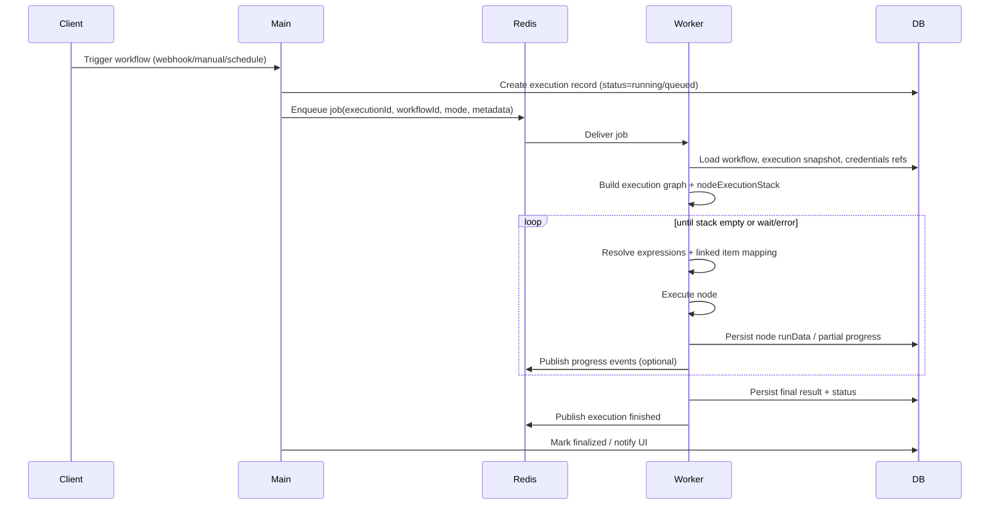

# n8n architecture and workflow execution
_Exported on 4/26/2026 at 09:59:25 GMT+5:30 from Cursor (3.1.10)_

---

**User**

I am building project same like n8n, I have build frontend for it,  am currently working on workflow Execution engine, which execute workflows, could you please give me architecture of actual n8n how it is working I need exact same architecture like n8n, could you please check their architecture and give me architecture with diagram, with all edge cases they are handing and also how they are managing context of previous node run from same node, as I believe wee can add previous node output as a parameter value of current node.. give me full end to end architecture with explanation how it has selected this approach...

---

**Cursor**

I’ll quickly pull current n8n architecture references from their docs/repo so I can give you an accurate end-to-end design, including execution flow, context handling, and edge cases with a clear diagram.

You’re building the right thing to copy from n8n: **split control-plane from execution-plane**.

Below is an n8n-style architecture you can implement almost 1:1 for self-hosted queue mode (the production pattern n8n recommends).

## 1) n8n Runtime Architecture (Production / Queue Mode)

```mermaid
flowchart LR
  U[User / External System] --> LB[Load Balancer]
  LB --> M1[Main API/UI Instance]
  LB --> W1[Webhook Instance(s)]

  M1 --> DB[(Postgres)]
  M1 --> R[(Redis / Bull Queue)]
  W1 --> R
  W1 --> DB

  R --> WK1[Worker 1]
  R --> WK2[Worker N]
  WK1 --> DB
  WK2 --> DB

  M1 <-->|pub/sub events| R
  WK1 <-->|progress/events| R
  WK2 <-->|progress/events| R
```

### Responsibilities

- `Main`:
  - serves UI + REST API
  - receives manual runs / trigger setup / workflow CRUD
  - schedules at-most-once jobs (cron/pollers/cleanup in leader)
  - enqueues execution jobs, tracks status
- `Webhook process` (optional but common at scale):
  - accepts webhook HTTP fast
  - validates route/workflow
  - enqueues job immediately
- `Worker`:
  - pulls job from queue
  - loads workflow + credentials + static data
 

- executes node graph
  - persists progress/final result
  - emits completion event

- `Redis`:
  - queue + locking + pub/sub
- `Postgres`:
  - source of truth (workflows, executions, credentials refs, run data, binary refs)

---

## 2) Execution Lifecycle (end-to-end)



---

## 3) Core Engine Design (why n8n chose this)

n8n’s core engine (`WorkflowExecute`) is effectively:

- **graph traversal + stack/queue of runnable nodes**
- **item-based execution model** (array of `{json,binary,pairedItem}`)
- **run data per node per runIndex per output branch**
- **resume-aware state machine** (for wait/webhook resume/retry)

### Why this approach works

- **Scales horizontally**: workers can be added without touching API/UI.
- **Reliability**: state persisted to DB; execution can survive process restart.
- **Low coupling**: trigger intake and heavy execution are separated.
- **Debuggability**: node-level runData gives rich audit trail.
- **Deterministic mapping**: item-linking (`pairedItem`) preserves lineage between nodes.

---

## 4) How previous-node context works (your key question)

Yes—n8n lets current node params read previous node output through expression/data proxies.

Typical patterns:

- current item: `$json.field`
- from specific node: `$("NodeName").first().json.foo`
- linked item from upstream: `$("NodeName").item.json.foo`
- all items from node: `$("NodeName").all()`

### Under the hood

Engine keeps, for each node run:

- `runData[nodeName][runIndex].data.main[outputIndex] = items[]`
- each output item may include `pairedItem` pointing to input lineage
- when evaluating `$("X").item`, engine follows lineage map (not just “first item”)
- for branches/loops, `branchIndex` + `runIndex` disambiguate which prior emission to use

That is exactly how n8n avoids wrong mappings in IF/Switch/Loop/Merge paths.

---

## 5) Edge cases n8n-style engines handle

If you want “same architecture”, these are must-have:

- **Branching ambiguity**: IF/Switch produce multiple outputs; expression lookup must resolve correct branch.
- **Loops / multiple runs of same node**: same node executes many times (`runIndex` increments).
- **Merge semantics**: by position/key/all-combinations modes can break lineage if not explicit.
- **Partial execution**: run subset up to destination node for editor test.
- **Pinned/mock data (editor)** vs production data paths.
- **Wait node / webhook resume**: persist continuation token + suspended state.
- **Retries**:
  - node-level retry with backoff
  - execution-level retry from failed node or from start
- **Timeout + cancellation**: abort signal propagated to active node.
- **Idempotency for webhooks** (user responsibility + engine hooks).
- **Binary data handling**:
  - avoid storing huge blobs inline in execution JSON
  - use filesystem/S3/object store pointer
- **Credential isolation**:
  - decrypt only in worker at runtime
  - never expose plaintext to frontend
- **Concurrency limits**:
  - global worker concurrency
  - optional per-workflow/per-node throttle
- **Queue stuck/running mismatch**:
  - heartbeat + stale lock recovery
- **Version consistency** in distributed mode:
  - mains/workers should run same build
- **Leader-only tasks** in multi-main:
  - schedule pollers/cron/cleanup only once

---

## 6) Data model you should copy

Minimal entities (n8n-like):

- `workflow` (definition JSON, active, settings)
- `execution` (id, workflowId, mode, status, startedAt, stoppedAt, trigger data)
- `execution_data` (runData snapshot, error, metadata, waitTill/resume info)
- `credentials` (encrypted payload + type)
- `shared_workflow`, `project` (if multi-tenant)
- `binary_data` (external pointer + metadata)

### Execution status state machine

`new -> running -> waiting -> resumed -> success | error | canceled`

---

## 7) Recommended implementation blueprint for your executor

```mermaid
flowchart TD
  A[Trigger Intake] --> B[Create Execution Record]
  B --> C[Enqueue Job]
  C --> D[Worker Loads Snapshot]
  D --> E[Execution Engine Loop]
  E --> F{Node Type}
  F -->|regular| G[execute() returns items]
  F -->|trigger/poller| H[special lifecycle]
  F -->|wait| I[persist wait state + suspend]
  G --> J[store runData + pairedItem]
  H --> J
  I --> K[exit as waiting]
  J --> L[enqueue next runnable nodes]
  L --> M{done?}
  M -->|no| E
  M -->|yes| N[finalize execution]
```

---

## 8) Practical guidance for your “n8n-like” context API

Expose a context helper layer in node runtime:

- `ctx.input.item`, `ctx.input.all()`
- `ctx.node("NodeName").all(branchIndex?, runIndex?)`
- `ctx.node("NodeName").item(currentInputIndex)` (lineage-safe)
- `ctx.vars` / `ctx.static.workflow` / `ctx.static.node`
- `ctx.execution.id`, `ctx.execution.mode`, `ctx.execution.resumeToken`

Internally back this by:

- `runData` map
- `pairedItem` lineage references
- resolver that understands branch + run index + loop depth

---

## 9) Important note on “exact same architecture”

“Exact same” is possible at system design level (queue + worker + runData + lineage + resume model).  
But exact parity with all n8n internals takes many iterations because behavior also depends on:

- expression engine quirks
- node package contracts
- legacy compatibility modes
- editor-specific partial-run behavior

Best path: copy **execution contracts first**, then match edge-case behavior using fixture workflows.

---

If you want, I can next give you a **concrete TypeScript skeleton** (interfaces + class layout) for your `WorkflowExecute`, `ExecutionRepository`, `JobProcessor`, and `ExpressionResolver` so you can start implementing this architecture directly in your `workflow-executor` app.

---

**User**

createe comprehasivee to-do items frrom this above architecture so i can create same n8n type architecture own my own.

---

**Cursor**

Great next step.  
Below is a **comprehensive, build-ready todo list** to implement an n8n-like execution architecture end-to-end.

## Phase 0: Scope and Constraints

- [ ] Define v1 scope: supported node types (trigger, action, if/switch, merge, code, wait, loop).
- [ ] Decide execution mode support: `regular` first or `queue` first (recommend queue-first for parity).
- [ ] Define non-goals for v1 (multi-main HA, advanced retries, custom node marketplace, etc.).
- [ ] Lock core invariants:
  - workflow execution is item-based
  - runData is persisted
  - lineage (`pairedItem`) is preserved
  - suspended executions can resume safely

---

## Phase 1: Core Data Contracts (Most Important)

- [ ] Create TypeScript interfaces for:
  - `IWorkflow`, `INode`, `IConnection`
  - `IExecution`, `IRunExecutionData`, `IRunData`
  - `INodeExecutionData` (`json`, `binary?`, `pairedItem?`)
  - `IExecutionContext`, `INodeContext`, `IExpressionContext`
- [ ] Define execution statuses and transitions:
  - `new`, `queued`, `running`, `waiting`, `success`, `error`, `canceled`
- [ ] Define `runIndex`, `outputIndex`, `branchIndex` behavior and standardize everywhere.
- [ ] Define error contract with rich metadata:
  - nodeName, runIndex, itemIndex, original error, retryable flag.

---

## Phase 2: Database Schema

- [ ] Create tables/entities:
  - `workflows`
  - `executions`
  - `execution_data` (or JSONB in executions)
  - `credentials` (encrypted payload)
  - `binary_data` pointers
- [ ] Add indexes:
  - executions by `(workflow_id, status, started_at)`
  - waiting executions by `resume_token` / `wait_till`
- [ ] Add migration strategy and versioning.
- [ ] Define retention/pruning policy for old execution data.

---

## Phase 3: Queue + Process Topology

- [ ] Set up Redis + BullMQ (or Bull equivalent) queues.
- [ ] Implement process roles:
  - `main` (API/UI + enqueue)
  - `worker` (execute jobs)
  - optional `webhook` (fast intake + enqueue)
- [ ] Implement worker concurrency config.
- [ ] Implement job payload contract:
  - executionId, workflowId, trigger metadata, attempt count, tenant/project id.
- [ ] Add heartbeat/stalled-job recovery logic.

---

## Phase 4: Execution Runner Orchestration

- [ ] Build `WorkflowRunner` service:
  - create execution record
  - enqueue job
  - mark lifecycle transitions
- [ ] Build `JobProcessor` on worker:
  - load execution snapshot
  - load workflow definition
  - invoke execution engine
  - persist completion/failure
- [ ] Add lifecycle hooks:
  - before execution
  - before node
  - after node
  - after execution
- [ ] Add cancellation support via abort signal + persisted cancel flag.

---

## Phase 5: Core Execution Engine (`WorkflowExecute`)

- [ ] Implement graph traversal using node stack/queue.
- [ ] Build node scheduling logic:
  - execute when all required inputs are ready (for merge-like nodes).
- [ ] Implement run loop:
  - resolve inputs
  - evaluate params/expressions
  - execute node
  - persist node output
  - schedule downstream nodes
- [ ] Support execution order mode (DFS/BFS equivalent) and choose one default.
- [ ] Implement destination-node/partial run mode for editor testing.

---

## Phase 6: Data Lineage and Previous Node Context (Critical)

- [ ] Implement `pairedItem` propagation on every node output.
- [ ] Store per-node outputs in `runData[nodeName][runIndex].data.main[outputIndex]`.
- [ ] Build resolver for context selectors:
  - current item (`$json`)
  - specific node outputs (`$("Node").first()/last()/all()`)
  - lineage item (`$("Node").item`)
- [ ] Add disambiguation using branchIndex/runIndex.
- [ ] Add fallback + clear errors for missing lineage/ambiguous references.

---

## Phase 7: Expression Engine

- [ ] Define expression syntax (`{{ ... }}` style).
- [ ] Provide safe runtime sandbox for expressions.
- [ ] Expose built-ins:
  - input, json, binary, node access, now/today helpers.
- [ ] Ensure deterministic expression evaluation order.
- [ ] Add expression preview API (needed by frontend later).

---

## Phase 8: Node Runtime Contracts

- [ ] Define node plugin interface:
  - metadata + parameters schema + execute method.
- [ ] Implement base node executor wrapper:
  - retries, timeout, error normalization, metrics.
- [ ] Add essential built-in nodes:
  - Manual Trigger / Webhook Trigger
  - HTTP Request
  - Set / Transform
  - IF / Switch
  - Merge
  - Loop Over Items
  - Wait
  - Code
- [ ] Implement node parameter validation before execute.

---

## Phase 9: Wait/Resume Architecture

- [ ] Implement `Wait` node persistence:
  - save wait state (token/time/webhook correlation)
  - set execution status `waiting`
- [ ] Build resume API:
  - resolve waiting execution by token/correlation id
  - restore runData and stack
  - continue from suspended node
- [ ] Handle duplicate resume calls safely (idempotency lock).

---

## Phase 10: Webhook Pipeline

- [ ] Build webhook registration lifecycle for active workflows.
- [ ] Implement webhook request validation and auth options.
- [ ] In queue mode: webhook process enqueues execution, returns immediate ack or waits per mode.
- [ ] Support response strategies:
  - immediate response
  - respond-at-end
  - respond-via-webhook-node
- [ ] Add replay-safe handling (optional but recommended).

---

## Phase 11: Reliability and Edge Cases

- [ ] Node-level retries with exponential backoff.
- [ ] Execution-level retry policy (manual retry/restart from failed node).
- [ ] Timeout controls:
  - node timeout
  - execution timeout
- [ ] Graceful worker shutdown:
  - stop polling
  - finish/park in-flight jobs
- [ ] Protect against stuck `running` executions:
  - heartbeat + stale detection + recovery.
- [ ] Handle worker crash recovery:
  - requeue or mark failed based on attempts policy.

---

## Phase 12: Binary Data Handling

- [ ] Decide binary storage backend:
  - local FS first, S3-compatible later.
- [ ] Store only references in runData (not large blobs).
- [ ] Add cleanup for orphaned binary objects.
- [ ] Implement signed URL or controlled fetch for binary reads.

---

## Phase 13: Security and Credentials

- [ ] Implement encrypted credentials store (at-rest encryption key).
- [ ] Decrypt only in worker runtime, never in frontend APIs.
- [ ] Add credential access policy per workflow/project.
- [ ] Mask secrets in logs and execution previews.
- [ ] Audit sensitive operations.

---

## Phase 14: Observability

- [ ] Structured logs with correlation IDs:
  - executionId, workflowId, nodeName, runIndex.
- [ ] Metrics:
  - queue depth, job latency, execution duration, node failures, retry counts.
- [ ] Health endpoints:
  - liveness/readiness for main/worker/webhook.
- [ ] Execution timeline events for UI consumption.

---

## Phase 15: API Surface (for Frontend Integration)

- [ ] Workflow CRUD APIs.
- [ ] Execution APIs:
  - start manual run
  - list/filter executions
  - execution detail (runData)
  - cancel/retry/resume
- [ ] Webhook test registration/unregistration APIs.
- [ ] Node definitions API (for dynamic UI forms).
- [ ] Expression preview API.

---

## Phase 16: Testing Strategy

- [ ] Unit tests:
  - expression resolver
  - lineage mapping
  - node scheduling
  - retry/timeout logic
- [ ] Integration tests:
  - end-to-end workflow with branching + merge + loops
  - wait/resume flow
  - webhook enqueue + execution
- [ ] Failure tests:
  - worker crash mid-run
  - Redis temporary outage
  - DB write failure during finalization
- [ ] Golden workflow fixtures to assert parity behavior.

---

## Phase 17: Deployment & Scaling

- [ ] Docker compose for local distributed dev:
  - main + worker + webhook + redis + postgres
- [ ] Production config:
  - queue mode
  - worker concurrency
  - DB pooling
  - autoscaling policy
- [ ] Add runbook:
  - stuck queue
  - high latency
  - retry storms
  - schema migration rollback.

---

## Phase 18: n8n-Parity Backlog (Post-v1)

- [ ] Multi-main leader/follower behavior for at-most-once tasks.
- [ ] Partial execution for editor with pin data.
- [ ] Advanced merge modes + robust item linking compatibility.
- [ ] Execution pruning policies + binary pruning.
- [ ] Advanced trigger types (pollers/persistent connections).

---

## Recommended Build Order (Practical)

1. Data contracts + DB schema  
2. Queue + runner + worker shell  
3. Minimal execution engine (linear path)  
4. Branching + merge + lineage  
5. Expression resolver + previous node references  
6. Wait/resume + webhook pipeline  
7. Retries/timeouts/cancel + observability  
8. Hardening + parity tests

---

If you want, I can convert this into a **ready-to-track sprint board format** (Sprint 1/2/3 with priorities, effort estimates, and acceptance criteria per task).

---

**User**

 convert this into a ready-to-track sprint board format (Sprint 1/2/3 with priorities, effort estimates, and acceptance criteria per task).

---

**Cursor**

## Sprint Board (n8n-like Workflow Engine)

Effort scale: `S (0.5-1d)`, `M (1-3d)`, `L (3-5d)`, `XL (5+d)`  
Priority: `P0` critical, `P1` important, `P2` nice-to-have

---

## Sprint 1 — Core Foundation (Engine Skeleton + Queue Execution)

### 1) Define execution contracts and status model
- **Priority:** P0  
- **Effort:** M  
- **Tasks:**
  - Create interfaces for workflow, node, connection, execution, runData, node item.
  - Define status machine: `new -> queued -> running -> waiting -> success|error|canceled`.
  - Define `runIndex`, `outputIndex`, `branchIndex` conventions.
- **Acceptance criteria:**
  - All core contracts are in shared types package/module.
  - Status transitions enforced in service methods.
  - Unit tests validate invalid transition rejection.

### 2) Create DB schema + migrations
- **Priority:** P0  
- **Effort:** L  
- **Tasks:**
  - Add tables/entities: `workflows`, `executions`, `execution_data`, `credentials`, `binary_data`.
  - Add indexes for status/time/workflow lookups.
  - Add migration scripts and rollback strategy.
- **Acceptance criteria:**
  - Fresh setup + migration works on local Postgres.
  - Query for “recent failed executions by workflow” is indexed.
  - Migration CI step passes.

### 3) Setup queue mode process topology
- **Priority:** P0  
- **Effort:** L  
- **Tasks:**
  - Integrate Redis + BullMQ.
  - Implement `main` enqueue flow and `worker` dequeue flow.
  - Define job payload contract (`executionId`, `workflowId`, metadata).
- **Acceptance criteria:**
  - Manual run request from main creates DB execution + queue job.
  - Worker consumes and acknowledges job successfully.
  - Failed job updates execution to `error`.

### 4) Implement WorkflowRunner + JobProcessor skeleton
- **Priority:** P0  
- **Effort:** M  
- **Tasks:**
  - Build orchestration service on main.
  - Build worker processor lifecycle (load, execute, persist, finalize).
  - Add hooks scaffold (before/after execution).
- **Acceptance criteria:**
  - End-to-end run for a linear 2-node workflow works.
  - Execution record contains start/end timestamps and status.
  - Hook points are called and test-covered.

### 5) Minimal execution engine loop (linear flows)
- **Priority:** P0  
- **Effort:** XL  
- **Tasks:**
  - Implement node stack/queue traversal.
  - Execute node -> collect outputs -> schedule next node.
  - Persist runData per node/run.
- **Acceptance criteria:**
  - Linear workflows execute deterministically.
  - `runData[node][runIndex].data.main` persisted correctly.
  - Unit test for 3-node chain with transformed outputs passes.

### 6) Basic observability + health
- **Priority:** P1  
- **Effort:** M  
- **Tasks:**
  - Add structured logs with `executionId` and `nodeName`.
  - Add `/health` for main and worker.
  - Add basic metrics: queue depth, execution duration.
- **Acceptance criteria:**
  - Logs can trace one execution end-to-end.
  - Health endpoints return readiness/liveness.
  - Metrics visible in local dashboard/endpoint.

---

## Sprint 2 — Context, Branching, and Resumable Execution

### 1) Implement item lineage (`pairedItem`) and context resolver
- **Priority:** P0  
- **Effort:** XL  
- **Tasks:**
  - Propagate lineage on every output item.
  - Build resolver for current item + previous node lookup.
  - Support disambiguation by branch/run index.
- **Acceptance criteria:**
  - Current node can read correct upstream value after IF/Merge paths.
  - `$("Node").item` (or equivalent) returns lineage-correct item.
  - Tests cover branch ambiguity scenarios.

### 2) Expression engine (parameter evaluation)
- **Priority:** P0  
- **Effort:** L  
- **Tasks:**
  - Add `{{ ... }}` evaluator with safe sandbox.
  - Expose helpers: current input, previous node outputs, time helpers.
  - Define error shape for broken expressions.
- **Acceptance criteria:**
  - Expressions resolve in node params before execution.
  - Invalid expressions fail with node + param context.
  - Unit tests cover happy path and sandbox restrictions.

### 3) Add branching + merge + loop semantics
- **Priority:** P0  
- **Effort:** XL  
- **Tasks:**
  - Implement IF/Switch multi-output scheduling.
  - Implement Merge node strategies (at least by position + append for v1).
  - Implement Loop-over-items behavior and runIndex increments.
- **Acceptance criteria:**
  - Branch workflows produce expected output sets.
  - Merge behavior matches documented mode definitions.
  - Loop executes per-item and preserves lineage.

### 4) Wait/Resume architecture
- **Priority:** P0  
- **Effort:** L  
- **Tasks:**
  - Persist wait state and set execution `waiting`.
  - Add resume endpoint/token flow.
  - Restore and continue execution safely.
- **Acceptance criteria:**
  - Wait node suspends and does not lose runData.
  - Resume request continues from suspended point.
  - Duplicate resume is idempotent (no double-processing).

### 5) Webhook intake path (queue-aware)
- **Priority:** P1  
- **Effort:** L  
- **Tasks:**
  - Implement webhook registration for active workflows.
  - Webhook request -> enqueue execution job.
  - Support immediate ack mode first.
- **Acceptance criteria:**
  - Production webhook triggers queued execution.
  - Response is fast and independent of worker runtime.
  - Webhook auth/validation baseline in place.

### 6) Binary data references (not inline blobs)
- **Priority:** P1  
- **Effort:** M  
- **Tasks:**
  - Add binary storage adapter (local FS first).
  - Save pointer in runData, not raw blob.
  - Add cleanup hooks for orphaned files.
- **Acceptance criteria:**
  - Large binary passes between nodes without DB bloat.
  - Binary metadata and retrieval work in execution view.
  - Cleanup job removes orphaned data.

---

## Sprint 3 — Reliability, Security, and Production Hardening

### 1) Retry, timeout, and cancellation controls
- **Priority:** P0  
- **Effort:** L  
- **Tasks:**
  - Node-level retry with backoff.
  - Execution-level timeout + node timeout.
  - Cancellation via abort signal + persisted flag.
- **Acceptance criteria:**
  - Retryable node failures retry according to policy.
  - Timeout marks execution/node with clear failure reason.
  - Cancel request stops running execution safely.

### 2) Worker crash/stalled recovery
- **Priority:** P0  
- **Effort:** L  
- **Tasks:**
  - Heartbeat for running executions.
  - Detect stalled jobs/runs and recover or fail deterministically.
  - Graceful shutdown handling for workers.
- **Acceptance criteria:**
  - Simulated worker kill does not leave indefinite `running`.
  - Stalled execution transitions by policy (requeue/fail).
  - Worker shutdown drains or parks in-flight jobs.

### 3) Credentials encryption and secret hygiene
- **Priority:** P0  
- **Effort:** M  
- **Tasks:**
  - Encrypt credential payload at rest.
  - Decrypt only in worker runtime.
  - Mask secrets in logs/error surfaces.
- **Acceptance criteria:**
  - No plaintext credential exposure in DB dumps/logs.
  - Credential use works during node execution.
  - Security test verifies masking behavior.

### 4) Execution API completeness for frontend
- **Priority:** P1  
- **Effort:** L  
- **Tasks:**
  - Add APIs: start, list, detail, cancel, retry, resume.
  - Add filtering/pagination by status/workflow/date.
  - Add execution timeline events payload.
- **Acceptance criteria:**
  - Frontend can manage full execution lifecycle via APIs.
  - Pagination/filtering performs within target response time.
  - API contract documented and versioned.

### 5) Test suite hardening (unit + integration + failure)
- **Priority:** P0  
- **Effort:** XL  
- **Tasks:**
  - Add fixture workflows for parity scenarios.
  - Add integration tests for queue + webhook + wait/resume.
  - Add chaos/failure tests (Redis down, DB transient errors, worker crash).
- **Acceptance criteria:**
  - CI includes integration workflow suite.
  - Key failure modes have deterministic expected outcomes.
  - Regression tests exist for lineage + expression resolver.

### 6) Deployment, runbook, and scaling guide
- **Priority:** P1  
- **Effort:** M  
- **Tasks:**
  - Create docker-compose for main/worker/webhook/redis/postgres.
  - Document worker concurrency and scaling playbook.
  - Create operational runbook for stuck queue, high latency, retry storms.
- **Acceptance criteria:**
  - One-command local distributed startup works.
  - On-call runbook resolves top 5 incident classes.
  - Basic autoscaling recommendations documented.

---

## Suggested Definition of Done (all sprints)

- [ ] Code merged with tests and migration scripts.
- [ ] Observability added for new execution paths.
- [ ] Backward compatibility checked for existing workflows.
- [ ] Docs updated (`architecture`, `runbook`, `API`).
- [ ] Demo workflow validates feature behavior.

---

## Recommended Owner Split (if team of 3-4)

- **Platform/Infra:** Queue, worker lifecycle, health, deployment.
- **Engine:** Traversal, lineage, expression resolver, wait/resume.
- **API/Data:** DB schema, repositories, execution APIs.
- **QA/Automation:** Fixture workflows, failure tests, regression packs.

---

If you want, I can now give this in a **copy-paste Jira format** (Epic -> Story -> Subtasks with IDs like `ENG-101`) so you can import directly.

